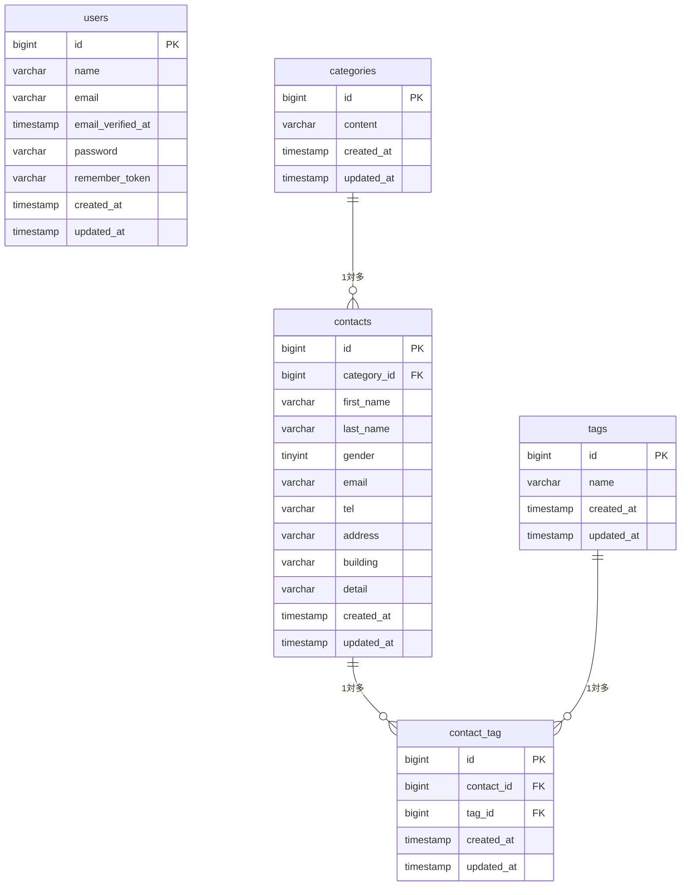

# COACHTECH お問い合わせフォーム

Laravel + MySQL + Docker(Laravel Sail)で構築した、お問い合わせフォームアプリケーションです。
一般ユーザー向けのお問い合わせフォーム(Web)と、管理者向けの管理画面(Web)、およびお問い合わせデータを操作できる公開API(REST API)を実装しています。

## 概要

- 一般ユーザーは、お問い合わせフォームから氏名・連絡先・お問い合わせ内容などを送信できます(入力 → 確認 → 完了の3ステップ構成)。
- 管理者はログイン後、管理画面からお問い合わせの検索・詳細確認・削除、およびタグの追加・編集・削除ができます。
- 上記に加えて、認証不要で利用できる公開API(`/api/v1/contacts`)を実装しており、お問い合わせの一覧取得・詳細取得・登録・更新・削除をJSON形式で行えます。

## ER図



`contacts`と`tags`は`contact_tag`を中間テーブルとした多対多の関係です。

## 使用技術

- PHP 8.2
- Laravel 10.x
- MySQL 8.0
- Nginx
- Laravel Fortify(認証)
- Vite, Tailwind CSS ^3.4.0
- Docker, Laravel Sail, phpMyAdmin

## 環境構築手順

### 前提

- Docker Desktopがインストール・起動していること

### 手順

1. リポジトリをクローンする

    ```bash
    git clone https://github.com/yume0606/contact-form-app.git
    cd contact-form-app
    ```

2. 環境変数ファイルを準備する

    ```bash
    cp .env.example .env
    ```

    `.env`のDB接続情報がSail標準の設定(`DB_HOST=mysql`など)になっていることを確認してください。

3. Composerの依存パッケージをインストールする

    Sailを未導入の場合は、一時的にComposerコンテナを使ってインストールします。

    ```bash
    docker run --rm \
        -u "$(id -u):$(id -g)" \
        -v "$(pwd):/var/www/html" \
        -w /var/www/html \
        laravelsail/php82-composer:latest \
        composer install --ignore-platform-reqs
    ```

4. Sailコンテナを起動する

    ```bash
    sail up -d
    ```

5. アプリケーションキーを生成する

    ```bash
    sail artisan key:generate
    ```

6. マイグレーションとシーディングを実行する

    ```bash
    sail artisan migrate --seed
    ```

    これにより、管理者アカウント(`test@example.com` / `password`)・カテゴリ5件・タグ5件・お問い合わせ20件(ダミーデータ)が投入されます。

7. フロントエンドの依存パッケージをインストールし、ビルドする

    ```bash
    sail npm install
    sail npm run dev
    ```

    `sail npm run dev`は実行したままにしておく必要があります。

8. ブラウザでアクセスする

    [http://localhost](http://localhost)

## 開発環境URL

- お問い合わせフォーム: http://localhost
- 管理画面ログイン: http://localhost/login
- 管理画面: http://localhost/admin
- phpMyAdmin: http://localhost:8080(ユーザー名: `sail` / パスワード: `password`)

## APIエンドポイント一覧

認証不要の公開APIです(Sanctum等の認証は使用していません)。

| メソッド | パス                         | 概要                                                                              |
| -------- | ---------------------------- | --------------------------------------------------------------------------------- |
| GET      | `/api/v1/contacts`           | お問い合わせ一覧取得(keyword/gender/category_id/dateで検索、ページネーション対応) |
| GET      | `/api/v1/contacts/{contact}` | お問い合わせ詳細取得                                                              |
| POST     | `/api/v1/contacts`           | お問い合わせ登録                                                                  |
| PUT      | `/api/v1/contacts/{contact}` | お問い合わせ更新                                                                  |
| DELETE   | `/api/v1/contacts/{contact}` | お問い合わせ削除                                                                  |

## 補足: バリデーションメッセージの日本語化について

外部の翻訳パッケージ(`laravel-lang/*`など)は使用せず、各`FormRequest`の`messages()`メソッドでバリデーションエラーメッセージを日本語化しています。

## テスト

```bash
sail artisan test
```

バリデーションの単体テスト、およびAPIエンドポイントの機能テストを実装しています。

## 作成者

東海林 夢
